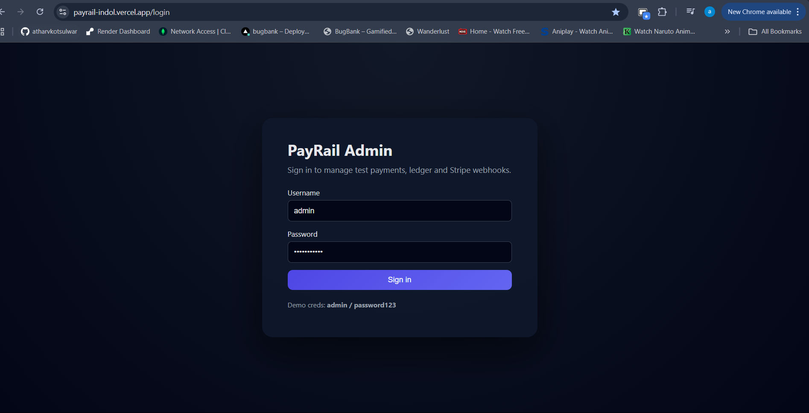
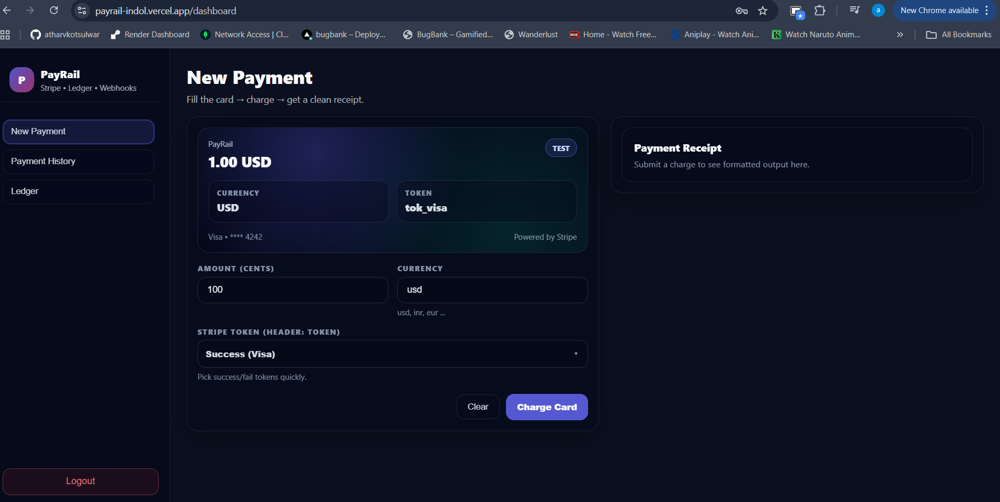
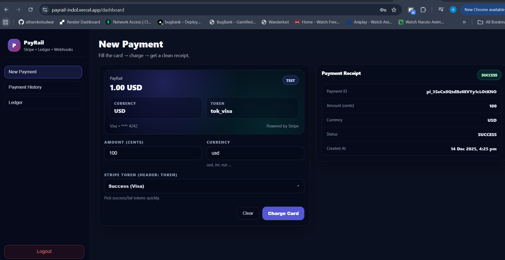
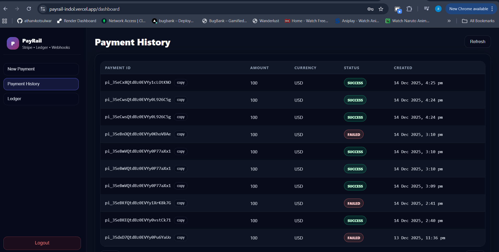
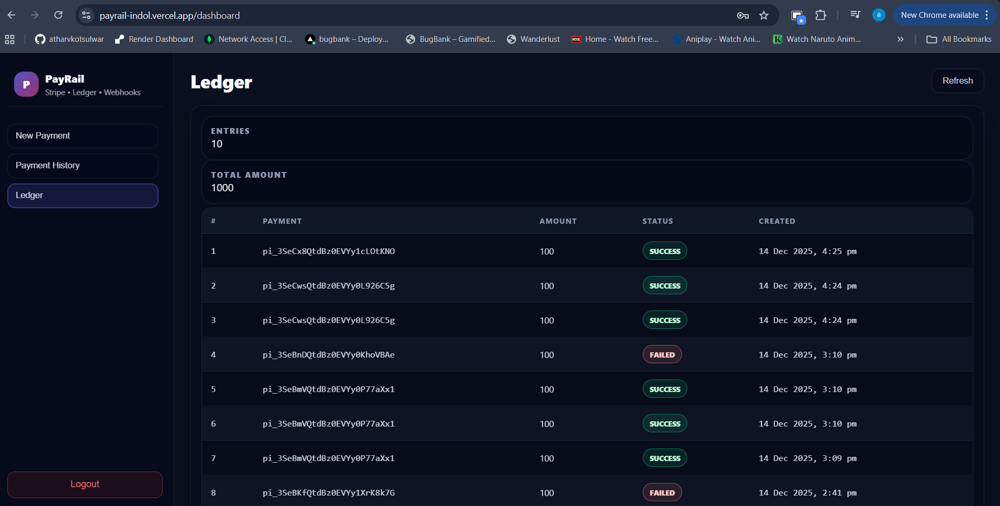
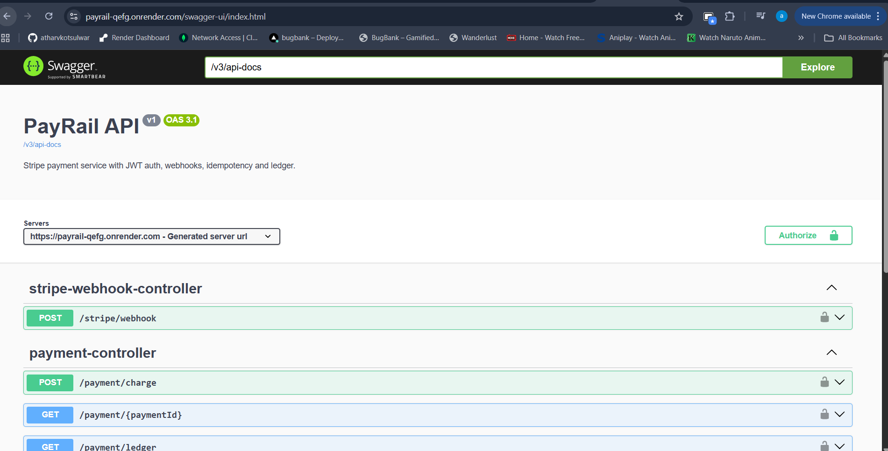
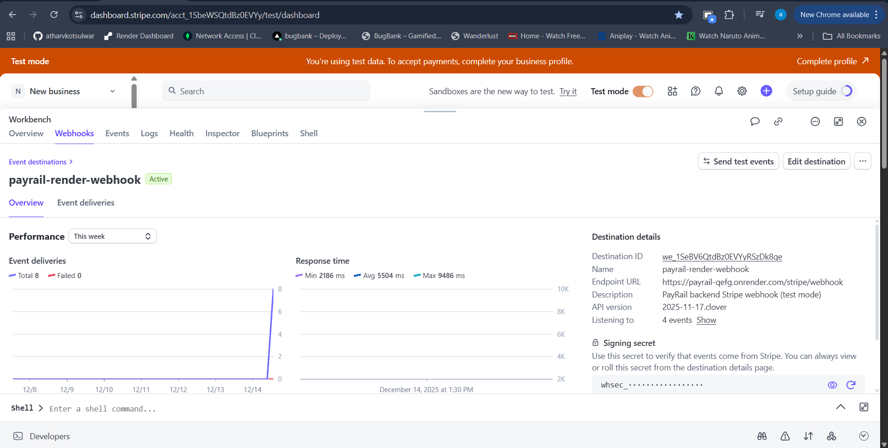

# PayRail 💳 — Payments + Webhooks + Ledger (Spring Boot + Stripe + MySQL)

PayRail is a production-style payments and ledger service built using **Spring Boot**, **Stripe (PaymentIntents + Webhooks)**, **JWT authentication**, and **MySQL**.

It demonstrates real-world payment workflows such as webhook-driven state transitions, idempotent event handling, and an append-only ledger for auditability.

> ⚠️ This project runs entirely in **Stripe Test Mode**. No real payments are processed.

---

## 🔗 Live Links
- **Frontend (Vercel):** https://payrail-indol.vercel.app/dashboard  
- **Backend (Render):** https://payrail-qefg.onrender.com  
- **Swagger UI:** https://payrail-qefg.onrender.com/swagger-ui/index.html  
- **GitHub Repo:** https://github.com/atharvkotsulwar/Payrail  

---

## ✨ Key Features
- JWT-based authentication
- Stateless REST APIs with JWT-based authorization
- Stripe PaymentIntent creation & confirmation
- Stripe Webhooks for asynchronous payment status updates
- Webhook signature verification (`STRIPE_WEBHOOK_SECRET`)
- Idempotent webhook processing (prevents duplicate ledger entries)
- Append-only ledger system for payment auditing
- MySQL persistence using JPA/Hibernate
- Pagination & sorting (latest-first)
- Dockerized Spring Boot backend
- Swagger / OpenAPI documentation

---

## 📁 Project Structure
```txt
Payrail/
├── payrail-backend/    # Spring Boot API (JWT + Stripe + Webhooks + MySQL)
└── payrail-frontend/   # React + Vite dashboard
```

---

## 🔐 Demo Credentials
- **Username:** `admin`
- **Password:** `password123`

---

## ▶️ Quick Demo Flow
1. Open https://payrail-indol.vercel.app/dashboard  
2. Login with demo credentials  
3. Create a new payment  
4. Use Stripe test cards:
   - `4242 4242 4242 4242` → success
   - `4000 0000 0000 0002` → failure
5. Verify payment history & ledger updates

---

## 🔔 Stripe Webhook Setup (Test Mode)

**Endpoint URL**
```txt
https://payrail-qefg.onrender.com/api/webhooks/stripe
```

**Events**
- `payment_intent.succeeded`
- `payment_intent.payment_failed`

**Webhook Secret**
```txt
STRIPE_WEBHOOK_SECRET=whsec_XXXXXXXX
```

---

## 🧪 Local Setup (Optional)

### Backend
```bash
cd payrail-backend
mvn spring-boot:run
```

### Frontend
```bash
cd payrail-frontend
npm install
npm run dev
```

## 📸 Screenshots

### 🔐 Login


### 📊 Dashboard


### 💳 New Payment
Initiate a new card payment with amount and currency selection.


### 📜 Payment History
View all past payments with latest transactions on top.


### 📒 Ledger
Immutable ledger showing financial events for each payment.


### 📘 API Documentation (Swagger)
Explore and test secured APIs using Swagger UI.


### 🔔 Stripe Webhooks
Stripe webhook events received and processed reliably.


---

## 🧠 Resume One-Liner
PayRail — Built a payments and ledger microservice using **Spring Boot, Stripe Webhooks, JWT, and MySQL**, implementing idempotent webhook handling and deployed end-to-end on **Render + Vercel**.
